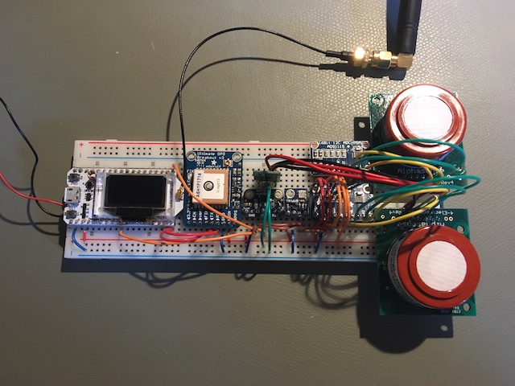
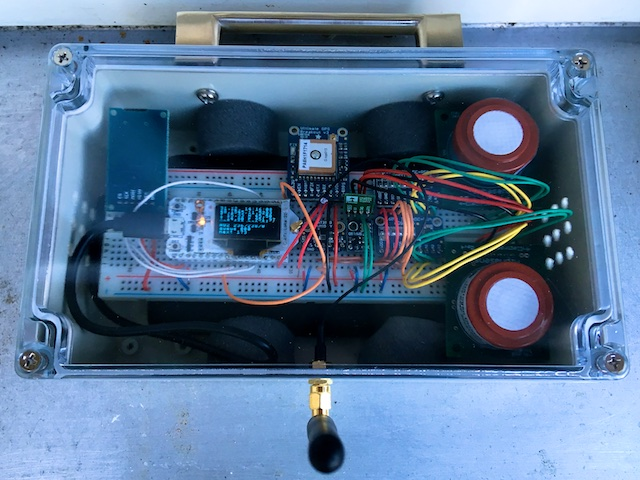
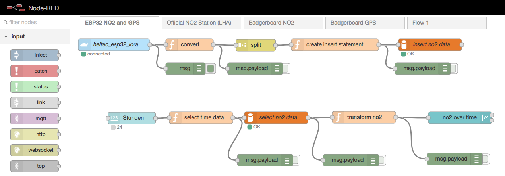
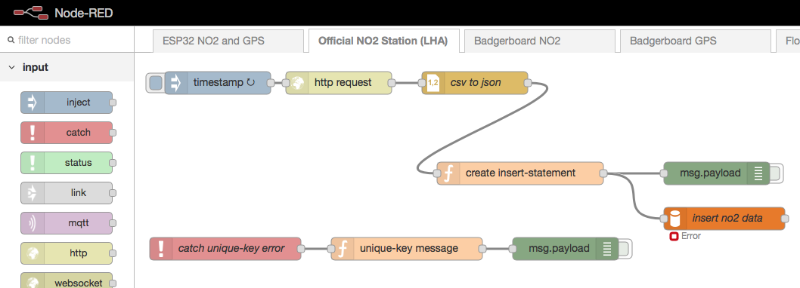
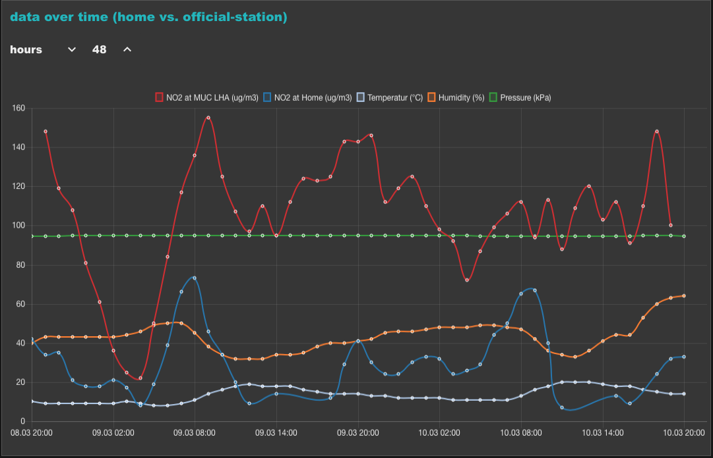
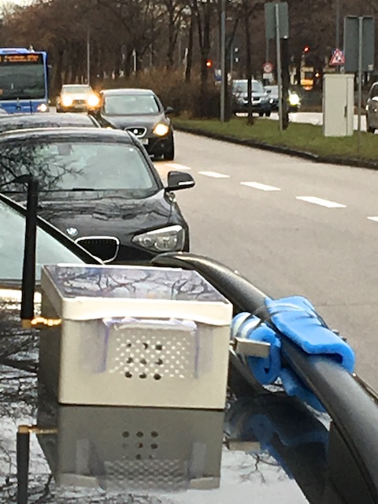
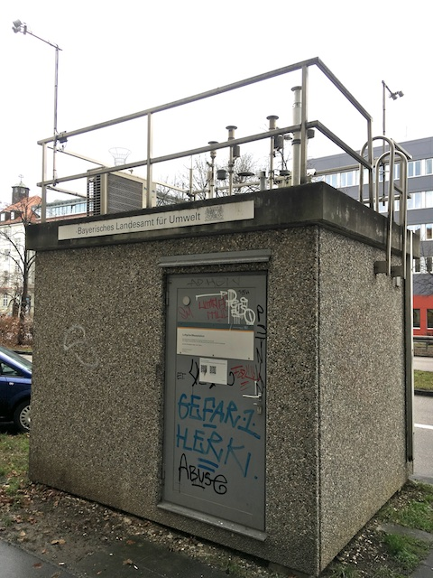

# Introduction
In this project I built a NO2 measurement station which sends its data via LoRaWan to TheThingsNetwork. A backend nodered server receives the messages and stores them into a MySQL database and then displays all on a dashboard. This project is inspired by the Urban AirQ (http://waag.org/en/project/urban-airq) of the waag society (Results are published here: https://www.atmos-meas-tech-discuss.net/amt-2017-43/). My intention to start this project was to show the amount of NO2 pollution at my home compared to the official measurement station "Landshuter Allee" of my hometown which is one kilometer away.

The NO2 measurement station uses two NO2 sensors, a temperature and humidity sensor, an air-pressure sensor and a GPS module. The sensors are connected with the ESP32 microcontroller which has an OLED display and a LoRa module onboard. All the hardware is powered with a powerbank.

# Hardware
* 1x Heltec ESP32 with LoRa and OLED (http://www.heltec.cn)
* 2x NO2 sensors from Alphasense (http://www.alphasense.com/index.php/products/nitrogen-dioxide-2)
* 2x analog/digital converter ADS1115 from Adafruit
* 1x temperature and humidity sensor SHT31 from Adafruit
* 1x air-pressure sensor BMP180 from Adafruit
* 1x GPS module from Adafruit
* 1x 5V step-up-converter (Pololu reg09b) to power the NO2 sensor
* 1x Powerbank with 20.000 mAh
* 1x weatherproofed casing

# Software-Stack
* Visual Studio Code with PlatformIO (https://code.visualstudio.com and http://platformio.org)
  * Arduino project in C++
    * LMIC library for LoRaWan (https://github.com/lmic-lib/lmic)
    * TinyGPSPlus library for GPS (https://github.com/mikalhart/TinyGPSPlus)
    * U8x8 library for OLED (https://github.com/olikraus/u8g2)
    * Adafruit SHT31 library
    * Adafruit BMP085 unified library
    * Adafruit ADS1015 library
* LoRaWan infrastructure from TheThingsNetwork (https://www.thethingsnetwork.org)
* MySQL database Server
* Node-RED server (https://nodered.org) with additional plugins
  * node-red-contrib-ttn (receiving the LoRaWan messages)
  * node-red-dashboard (dashboard for visualizing the data)
  * node-red-node-mysql (inserting and reading the data from the MySQL database)
  * node-red-contrib-web-worldmap (open-street-map pluging)

# Calibration of the NO2 sensor
The NO2 sensors are pre-calibrated and are shipped with a formular to calculate the NO2 concentration in ppb with the measured output voltages of the sensor. Because the results are poor I decided to calibrate the sensors against the measurement data of the official measurement station (http://inters.bayern.de/luebmw/csv/blfu_1404_NO2.csv) of my hometown. I placed my hardware on the roof of my car and placed my car next to the offical station. So I was able to store the measured data of 2 days on the flash memory of the ESP32. With this data I used linear regression (calculate with LibreOffice LINEST function: https://help.libreoffice.org/Calc/Array_Functions#LINEST) to get a linear function which outputs the NO2 concentration in ug/m3 like the official station does. For the linear regression I used the output voltage of NO2 sensor, the temperture, the humidity and the pressure as input data to get the values of the official station.

# Power consumption
The power consumption is high (==TODO==) because the NO2 sensor has an integrated heating.

# Tasks
- Software
  - [x] build software for offline mode (SD-card instead of LoRaWan)
  - [x] add images to the readme page
- Testrun (hardware & software)
  - [x] 2 day testrun - proof of stability and power consumption --> 01.01.2018 - 02.01.2018
  - [ ] 5 day testrun - proof of stability --> 12.02.2018 - ???
- Calibration
  - [x] 1. calibration run --> 02.01.2018 14:00 - 04.01.2018 - 09:00 --> failed with no data :-(
  - [x] 2. calibration run --> 05.01.2018 12:00 - 07.01.2018 - 15:00 --> after one day no more no2 values (problems with the power supply) :-(
  - [ ] 3. calibration run (to gather data over a wider time-range)
- Regression
  - [x] define linear function with multiple linear regression
  - [x] modify nodred flow to use linear function to calculate NO2
- NodeRed
  - [ ] display worldmap on the nodered dashboard using geoJSON (https://github.com/dceejay/RedMap)
  - [ ] try Grafana for charts (https://grafana.com/grafana)

# Historical conflicts, issues and findings
* LMIC does not work in with RTOS (https://www.freertos.org) Tasks because of timing issues. There is no current version of the LMIC library for the ESP32. Because of this issue I decided to do not use tasks for measurement and sending.
* LMIC does not work in combination with the SD card reader. I think it's because they are both on the SPI bus. Because of this issue the SD card is only used in the offline mode (used for calibration only).
* SD card reader does not work very stable. First it does not work with 3.3V as described in the spec. Second it needs exact 5V, so I had to add an additional step-up-converter to power it. My first calibration-run ended with no data on the sd-card. I decided to switch to the internal flash-memory of the ESP32 using SPIFFS (the interface is nearly the same).
* After some hours running my sensor I'm facing I2C stability problems ([E][esp32-hal-i2c.c:161] i2cWrite(): Busy Timeout!). This is a known issue (https://github.com/espressif/arduino-esp32/issues/834). Trying to use reset wire if temperature measurement results in "not a number".